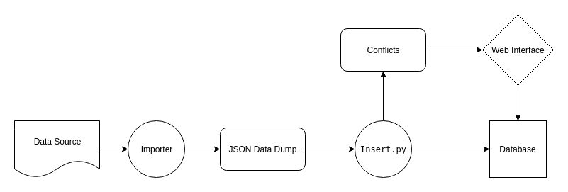

## About Me

__Name.__ Sumit Ghosh  
__MB Username + IRC Nickname.__ SkullTech  
__Github.__ [SkullTech](https://github.com/SkullTech)  
__Website + Blog.__ [https://sumit-ghosh.com](https://sumit-ghosh.com)  
__LinkedIn.__ [Link](https://www.linkedin.com/in/sumit-ghosh-skulltech/)  
__E-mail.__ sumit@sumit-ghosh.com  
__Time-zone.__ UTC +5:30  

# Proposal

## Project Overview

As of now, BookBrainz only supports adding data to the database manually through the web interface. Building a database of considerable size only by this method would be highly inefficient. To solve this problem, we could develop a complete system for importing third-party data into the BookBrainz database easily. 

The following text taken from [here](https://wiki.musicbrainz.org/Development/Summer_of_Code/2018/BookBrainz) sheds light on the plan developed my _Leftmost_ and _Sputnik_ regarding this matter.

> At last year's summit, the two BookBrainz lead developers, Leftmost and LordSputnik worked on a plan for importing third-party data into BookBrainz. This plan has several stages. First, data sources need to be identified, including mass import sources with freely available data, such as libraries, and manual import sources, such as online bookstores and other user-contributed databases. The next stage is to update the database to introduce an "Import" object, which can be used to distinguish mass imported data from (usually better quality) user contributions. Then, actual import bots for mass import and userscripts for manual import will need to be written. Finally, it would desirable (but not necessary if time is short) to introduce an interface to the BookBrainz site to allow users to review automatically imported data, and approve it.


As mentioned in the text above, we can work on this project dividing it into a few distinct stages. 

1. Updating the database schema.
2. Designing and creating the pipeline for importing and inserting data into the DB.
3. Identifying data sources and writing the importer for those sources.
4. (if time permits) Making a web interface for users to review conflicts.

### Updating the database schema

On the database side, a new table for storing the sources will be created. It will store an identifying name of the source, along with corresponding URL and description. A rough schema of the table is outlined below.

```sql
CREATE TABLE bookbrainz.source (
	id SERIAL PRIMARY KEY,
	name VARCHAR(64) NOT NULL UNIQUE CHECK (name <> ''),
	url VARCHAR(64) NOT NULL DEFAULT '',
	description TEXT NOT NULL DEFAULT '',
);
```

As we will be creating new entities from the imported data, we will need to specify the source in the stored data. For that, we will be modifying the entity table, adding two additional fields to it. One of the fields will indicate whether the entity is an imported one or user-contributed one. The other will point to the source in the case it is an imported one. The corresponding schema is outlined below. 

```sql
CREATE TABLE bookbrainz.entity (
	bbid UUID PRIMARY KEY DEFAULT public.uuid_generate_v4(),
	type bookbrainz.entity_type NOT NULL,
	imported BIT NOT NULL DEFAULT 0,
	source_id INT,
	CHECK ((source_id IS NOT NULL OR OR imported IS 0) AND (source_id IS NULL OR imported IS 1))
);
ALTER TABLE bookbrainz.entity ADD FOREIGN KEY (source_id) REFERENCES bookbrainz.source (id);
```

Here we added a check statement in the definition of entity, which takes care of the interdependent constraints between `source_id` and `imported`.

### Designing the _data import pipeline_

We will be creating a modular structure for the importer, so that new sources and the importer for that can be added later quite easily. The basic project structure will be somewhat like below.

```
.
├── dumps
│   └── librarything-2018-03-15T20:34:17+00:00.json
├── importers
│   ├── librarything.py
│   └── openlibrary.py
└── insert.py
```

Here, the scripts inside the `importers` directory import data from the corresponding source and then dump it in a specified format in a JSON file inside the folder `dumps`. After that, on running the `insert.py` script, it inserts the data dumped into the database. An example command to run it would be like the following
```console
$ python insert.py -d librarything-2018-03-15T20:34:17+00:00.json
```

Things to note here.
- The JSON files inside the dumps folder are of very well-specified format and are machine-generated.
- The importer scripts are free to import the data in whatever way they prefer. Possibilities include
    - Downloading and then reading a data dump file, such as the ones provided [here](https://openlibrary.org/developers/dumps) by OpenLibrary.
    - Accessing a web API.
    - Scraping the content off web-pages. (Very unreliable, would avoid).
- The modularity of this approach lies in the fact that the insert.py script does not care how the data was imported, it just reads it from the dump JSON file, and inserts it into the database.

__About *insert.py* and conflicts__

While inserting entries into the database from the data dumps, we will have to take care of the following
- Avoid duplicate entries
- Resolve conflicting entries

For this, the `insert.py` script can do the following. Before inserting, check if the database already has an entry for the same item. If it has, and if the data is conflicting (i.e the values stored in the database and the values imported do not match), save it separately for manual confirmation by a user. It can either be stored in a separate table in the database, or in a JSON file (something like _conflicts.json_). 



### Identifying data sources and writing importers

This step would involve researching about available sources for data, having a permissive license. Writing the importer scripts for those sources will have to done parallelly with this. Also, this stage can continue indefinitely, i.e new developers joining the project later on, can keep extending this part of the pipeline.

## Infrastructure to be used.

- We will be writing all the scripts (importers and _insert.py_) in Python.
- For CLI facilities of the scripts, the `argparse` library will be used.
- For interaction with the database, we can use something like [peewee](http://peewee-orm.com). It's a simple and clean ORM for Python. If it turns out to be inadequate, we can fall back to SQLAlchemy.
- For writing test suites, [pytest](https://pytest.org) could be used.
- For documentation, [Sphinx](http://sphinx-doc.org) along with [Read the Docs](https://readthedocs.org/) is an excellent solution.
- For any potential scraping and crawling, the [Scrapy](https://scrapy.org/) framework can be used.

## Timeline breakdown

The total coding time for SoC is 12 weeks, divided into 3 phases. 

__Timeline__

1. Updating the database schema. Week 1
2. Designing and creating the data import pipeline. Weeks 2 to 4.

_Phase 1 evaluation._

3. Identifying data sources and writing importers. Weeks 5 to 8.

_Phase 2 evaluation._

4. Making a web interface for users to review conflicts. Weeks 9 to 12.

_Final evaluation._
